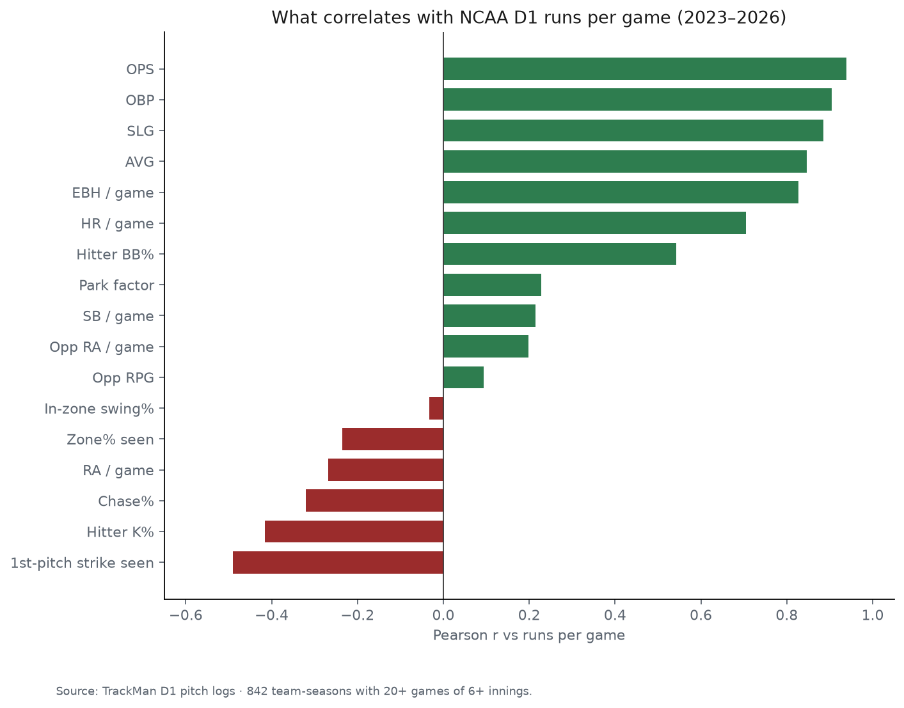
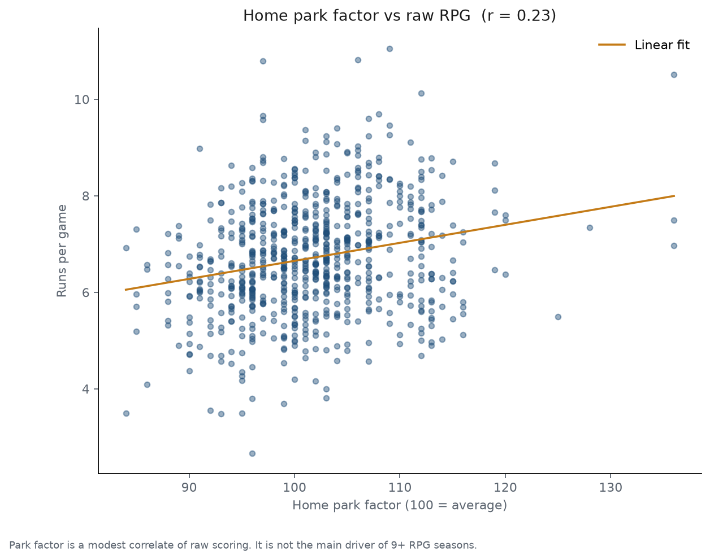
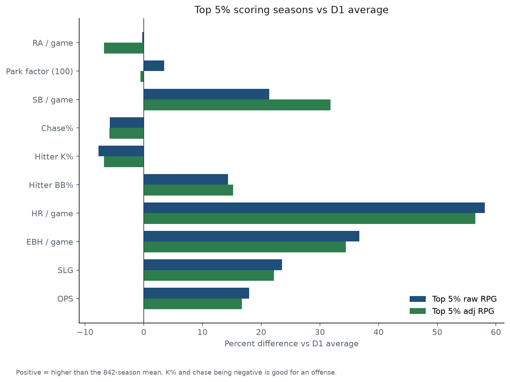
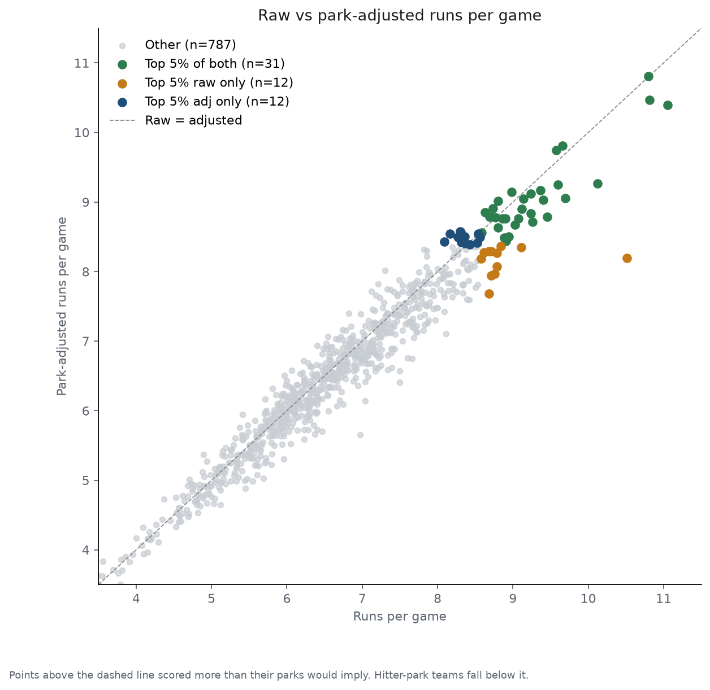

# NCAA D1 Runs Per Game (2023–2026)

What actually produces high-scoring college baseball offenses, and how much of that is park?

This project builds **team-season** offensive stats from TrackMan D1 pitch logs, joins every school in `trackman_d1_cube_index.csv`, park-adjusts runs using `ParkFactor_100`, and measures how metrics correlate with runs per game. Each school appears once per season (Oregon State, LSU, etc. have four rows: 2023–2026).

Creator: Kellen Swanson

---

## Research questions

1. Which offensive traits (AVG, SLG, HR, SB, EBH, walks, strikeouts, count/zone control) actually go with runs at the NCAA level?
2. Which teams have scored at an elite rate over the last four seasons, and do they still look elite after park adjustment?
3. How do those teams differ from a typical D1 team-season?

---

## Data

| File | Role |
| --- | --- |
| `Master23242526.csv` | TrackMan pitch-level data, 2023–2026 |
| `trackman_d1_cube_index.csv` | 308 D1 schools (TrackMan code → school name) |
| `parkfactor.csv` | Stadium park factors; **only `ParkFactor_100` is used** |

Coverage is TrackMan games, not the official NCAA schedule. `games_found` is distinct games in the logs; `games_used` keeps games with **6+ innings** tracked. Rate stats and percentiles use `games_used >= 20` (**842** team-seasons). 2023 coverage is thinner (mean ~24 games found) than 2026 (mean ~41).

---

## Methods

`runs_per_game_analysis.py` streams the master CSVs in chunks so they are never loaded whole.

- **Season** from pitch date: August–December counts as the next spring.
- **Runs** are summed from `RunsScored` for the batting team in each `GameUID`.
- **RPG** = runs scored / games with 6+ innings.
- **Plate appearances** use the last pitch of each PA for AVG / OBP / SLG / OPS, hitter K%, and hitter BB%. Extra-base hits = 2B + 3B + HR.
- **Count / zone control** (hitter’s view): first-pitch strike rate, zone% of pitches seen, chase% (swings at pitches out of a TrackMan zone of |side| ≤ 0.83 ft and height 1.5–3.5 ft).
- **Opponent RPG / opponent RA/G** = game-weighted mean of each opponent’s season rates (schedule strength).
- **Park-adjusted RPG:** for each game, `adj_runs = runs × 100 / ParkFactor_100` of the **home team’s** park (the stadium the game was played in). Road games use the opponent’s home factor. If a team has several stadiums in `parkfactor.csv`, the one with the most home games is used. Missing parks are treated as **100**. Then `adj_rpg = sum(adj_runs) / games`.

A factor of 111 means 11% more runs at that park; dividing by 1.11 puts scoring on a 100-park scale.

---

## What correlates with scoring

Among 842 qualified team-seasons, **OPS (r = 0.94)** is the strongest correlate of runs per game, then OBP, SLG, AVG, extra-base hits, and homers. Walks matter (BB% r = 0.54). Strikeouts and chase rate hurt. Stolen bases are a weak lever (r = 0.21). Opponent quality and home park factor are modest.



| Metric | Pearson r vs RPG | Spearman r | n |
| --- | ---: | ---: | ---: |
| OPS | 0.94 | 0.93 | 842 |
| OBP | 0.90 | 0.90 | 842 |
| SLG | 0.88 | 0.86 | 842 |
| AVG | 0.85 | 0.82 | 842 |
| EBH / game | 0.83 | 0.81 | 842 |
| HR / game | 0.71 | 0.68 | 842 |
| Hitter BB% | 0.54 | 0.54 | 842 |
| First-pitch strike seen | −0.49 | −0.48 | 842 |
| Hitter K% | −0.42 | −0.38 | 842 |
| Chase% | −0.32 | −0.30 | 842 |
| RA / game | −0.27 | −0.27 | 842 |
| Zone% seen | −0.24 | −0.23 | 842 |
| Park factor | 0.23 | 0.22 | 757 |
| SB / game | 0.21 | 0.21 | 842 |
| Opp RA / game | 0.20 | 0.15 | 842 |
| Opp RPG | 0.09 | 0.13 | 842 |
| In-zone swing% | −0.03 | −0.03 | 842 |

That is close to the MLB hierarchy (on-base plus power), with two NCAA-specific notes: **walks are a real run skill**, and **stolen-base volume is not** what separates 9-run clubs. First-pitch strike% here is pitches *seen* while batting, so a high rate mostly means facing strike-throwers (or taking fewer balls), which lines up with the negative correlation.

Home park factor vs raw RPG is only **r = 0.23**:



---

## Top 5% vs the D1 average

The top 5% of **raw RPG** is **8.58+** (43 seasons). The top 5% of **park-adjusted RPG** is **8.39+** (43 seasons). **31** seasons appear on both lists; each list is shown in full below.

Both groups look like extra-base clubs, not stolen-base clubs: about **1.80 HR/game vs 1.14** league-wide (**+58%**), OPS around **1.000 vs .854**, more walks, fewer strikeouts and chases.



| Metric | D1 average | Top 5% RPG | vs avg | Top 5% adj | vs avg |
| --- | ---: | ---: | ---: | ---: | ---: |
| Runs / game | 6.59 | 9.18 | +2.59 | 9.03 | +2.44 |
| Adj runs / game | 6.49 | 8.82 | +2.33 | 8.91 | +2.42 |
| OPS | .854 | 1.008 | +.154 | .997 | +.143 |
| OBP | .410 | .458 | +.049 | .454 | +.044 |
| SLG | .445 | .549 | +.105 | .543 | +.099 |
| AVG | .278 | .315 | +.038 | .311 | +.034 |
| EBH / game | 3.16 | 4.32 | +1.16 | 4.24 | +1.09 |
| HR / game | 1.14 | 1.80 | +0.66 | 1.78 | +0.64 |
| Hitter BB% | 11.2% | 12.8% | +1.6 pts | 12.9% | +1.7 pts |
| Hitter K% | 19.8% | 18.3% | −1.5 pts | 18.5% | −1.3 pts |
| Chase% | 25.0% | 23.5% | −1.4 pts | 23.5% | −1.5 pts |
| SB / game | 0.19 | 0.23 | +0.04 | 0.24 | +0.06 |
| Park factor | 102 | 105 | +3.5 | 101 | −0.6 |
| RA / game | 6.47 | 6.46 | −0.01 | 6.03 | −0.44 |
| Opp RA / game | 6.61 | 6.95 | +0.34 | 6.94 | +0.33 |

The **offense is almost the same**. The split is environment:

- The raw top 5% play in slightly livelier parks (PF **105 vs 102**) and allow a league-average **6.46** runs.
- The park-adjusted top 5% sit at a neutral PF (**101**) and allow **6.03** runs — so adjusting for park also surfaces clubs that prevent runs, not just hit in bandboxes.

Points below the dashed line in the scatter are hitter-park seasons whose raw RPG overstates talent (Morehead State, Texas Tech, Air Force). Points above it are pitcher-park seasons that look better after adjustment (Yale, Samford, Army, UNC).



---

## Top 5% raw runs per game (8.58+)

43 team-seasons. “Raw only” names miss the park-adjusted cut.

| School | Season | Games | RPG | Adj RPG | PF | OPS |
| --- | --- | ---: | ---: | ---: | ---: | ---: |
| Austin Peay | 2024 | 40 | 11.05 | 10.39 | 109 | 1.176 |
| Georgia Tech | 2026 | 54 | 10.81 | 10.46 | 106 | 1.139 |
| High Point | 2025 | 49 | 10.80 | 10.80 | 97 | 1.106 |
| Morehead State | 2024 | 35 | 10.51 | 8.19 | 136 | 1.109 |
| New Mexico | 2025 | 40 | 10.12 | 9.27 | 112 | 1.068 |
| USC Upstate | 2025 | 46 | 9.70 | 9.06 | 108 | 0.974 |
| Campbell | 2023 | 38 | 9.66 | 9.81 | 97 | 1.044 |
| Columbia | 2024 | 30 | 9.60 | 9.25 | 107 | 1.006 |
| Miami-Ohio | 2026 | 40 | 9.57 | 9.74 | 97 | 1.023 |
| Austin Peay | 2025 | 44 | 9.45 | 8.79 | 109 | 1.035 |
| Georgia | 2026 | 57 | 9.40 | 9.03 | 104 | 1.082 |
| Troy | 2024 | 44 | 9.36 | 9.17 | 101 | 0.981 |
| Appalachian State | 2024 | 35 | 9.26 | 8.72 | 109 | 0.977 |
| Mercer | 2026 | 54 | 9.24 | 9.12 | 103 | 1.048 |
| Coastal Carolina | 2023 | 54 | 9.24 | 8.84 | 107 | 0.980 |
| Virginia Tech | 2023 | 43 | 9.14 | 9.05 | 101 | 0.993 |
| Arizona | 2023 | 42 | 9.12 | 8.90 | 103 | 1.008 |
| LSU | 2023 | 56 | 9.11 | 8.35 | 111 | 1.025 |
| Georgia | 2024 | 57 | 9.07 | 8.76 | 104 | 1.063 |
| Tennessee | 2024 | 69 | 9.03 | 8.67 | 106 | 1.059 |
| Rhode Island | 2025 | 50 | 8.98 | 9.14 | 91 | 0.979 |
| Virginia | 2023 | 54 | 8.94 | 8.50 | 106 | 0.992 |
| Texas A&M | 2026 | 53 | 8.91 | 8.44 | 105 | 1.025 |
| Delaware | 2024 | 31 | 8.90 | 8.76 | 102 | 0.933 |
| Winthrop | 2025 | 52 | 8.88 | 8.49 | 105 | 0.912 |
| Connecticut | 2025 | 52 | 8.87 | 8.76 | 103 | 0.969 |
| Virginia | 2024 | 50 | 8.84 | 8.36 | 106 | 0.999 |
| Florida State | 2024 | 56 | 8.80 | 9.02 | 97 | 1.008 |
| Oakland | 2024 | 25 | 8.80 | 8.63 | 102 | 0.961 |
| UT San Antonio | 2026 | 52 | 8.79 | 8.26 | 108 | 0.958 |
| Charleston Southern | 2025 | 42 | 8.79 | 8.07 | 113 | 0.916 |
| Wake Forest | 2023 | 51 | 8.76 | 8.78 | 99 | 0.998 |
| New Mexico | 2024 | 37 | 8.76 | 7.97 | 112 | 1.000 |
| Campbell | 2024 | 45 | 8.73 | 8.91 | 97 | 1.003 |
| UT San Antonio | 2025 | 56 | 8.71 | 8.29 | 108 | 0.954 |
| Air Force | 2026 | 45 | 8.71 | 7.94 | 115 | 0.942 |
| Oregon State | 2024 | 48 | 8.69 | 8.79 | 97 | 1.007 |
| Coastal Carolina | 2024 | 54 | 8.69 | 8.29 | 107 | 0.936 |
| Texas Tech | 2026 | 53 | 8.68 | 7.68 | 119 | 0.996 |
| Davidson | 2025 | 43 | 8.63 | 8.85 | 94 | 0.988 |
| Columbia | 2025 | 47 | 8.62 | 8.27 | 107 | 0.938 |
| Oklahoma State | 2026 | 55 | 8.58 | 8.56 | 96 | 0.997 |
| Georgia Tech | 2023 | 50 | 8.58 | 8.19 | 106 | 1.020 |

Raw-only (hitter-park inflation): Morehead State 2024 (PF 136, 10.51 → 8.19 adj), Texas Tech 2026 (119), Air Force 2026 (115), Charleston Southern 2025, New Mexico 2024, LSU 2023, both recent UTSA seasons, Coastal Carolina 2024, Virginia 2024, Columbia 2025, Georgia Tech 2023.

---

## Top 5% park-adjusted runs per game (8.39+)

43 team-seasons. “Adj only” names miss the raw cut, usually because they play in pitcher parks.

| School | Season | Games | RPG | Adj RPG | PF | OPS |
| --- | --- | ---: | ---: | ---: | ---: | ---: |
| High Point | 2025 | 49 | 10.80 | 10.80 | 97 | 1.106 |
| Georgia Tech | 2026 | 54 | 10.81 | 10.46 | 106 | 1.139 |
| Austin Peay | 2024 | 40 | 11.05 | 10.39 | 109 | 1.176 |
| Campbell | 2023 | 38 | 9.66 | 9.81 | 97 | 1.044 |
| Miami-Ohio | 2026 | 40 | 9.57 | 9.74 | 97 | 1.023 |
| New Mexico | 2025 | 40 | 10.12 | 9.27 | 112 | 1.068 |
| Columbia | 2024 | 30 | 9.60 | 9.25 | 107 | 1.006 |
| Troy | 2024 | 44 | 9.36 | 9.17 | 101 | 0.981 |
| Rhode Island | 2025 | 50 | 8.98 | 9.14 | 91 | 0.979 |
| Mercer | 2026 | 54 | 9.24 | 9.12 | 103 | 1.048 |
| USC Upstate | 2025 | 46 | 9.70 | 9.06 | 108 | 0.974 |
| Virginia Tech | 2023 | 43 | 9.14 | 9.05 | 101 | 0.993 |
| Georgia | 2026 | 57 | 9.40 | 9.03 | 104 | 1.082 |
| Florida State | 2024 | 56 | 8.80 | 9.02 | 97 | 1.008 |
| Campbell | 2024 | 45 | 8.73 | 8.91 | 97 | 1.003 |
| Arizona | 2023 | 42 | 9.12 | 8.90 | 103 | 1.008 |
| Davidson | 2025 | 43 | 8.63 | 8.85 | 94 | 0.988 |
| Coastal Carolina | 2023 | 54 | 9.24 | 8.84 | 107 | 0.980 |
| Austin Peay | 2025 | 44 | 9.45 | 8.79 | 109 | 1.035 |
| Oregon State | 2024 | 48 | 8.69 | 8.79 | 97 | 1.007 |
| Wake Forest | 2023 | 51 | 8.76 | 8.78 | 99 | 0.998 |
| Connecticut | 2025 | 52 | 8.87 | 8.76 | 103 | 0.969 |
| Delaware | 2024 | 31 | 8.90 | 8.76 | 102 | 0.933 |
| Georgia | 2024 | 57 | 9.07 | 8.76 | 104 | 1.063 |
| Appalachian State | 2024 | 35 | 9.26 | 8.72 | 109 | 0.977 |
| Tennessee | 2024 | 69 | 9.03 | 8.67 | 106 | 1.059 |
| Oakland | 2024 | 25 | 8.80 | 8.63 | 102 | 0.961 |
| Yale | 2026 | 30 | 8.30 | 8.57 | 96 | 0.830 |
| Oklahoma State | 2024 | 52 | 8.31 | 8.57 | 96 | 0.978 |
| Oklahoma State | 2026 | 55 | 8.58 | 8.56 | 96 | 0.997 |
| Samford | 2024 | 30 | 8.17 | 8.55 | 93 | 0.952 |
| College of Charleston | 2024 | 24 | 8.54 | 8.54 | 100 | 0.977 |
| Oklahoma State | 2023 | 59 | 8.36 | 8.51 | 96 | 0.969 |
| Virginia | 2023 | 54 | 8.94 | 8.50 | 106 | 0.992 |
| North Carolina | 2024 | 59 | 8.56 | 8.50 | 100 | 0.967 |
| George Mason | 2025 | 45 | 8.27 | 8.49 | 95 | 0.912 |
| Winthrop | 2025 | 52 | 8.88 | 8.49 | 105 | 0.912 |
| Texas A&M | 2026 | 53 | 8.91 | 8.44 | 105 | 1.025 |
| Army | 2023 | 34 | 8.09 | 8.43 | 95 | 0.923 |
| Wright State | 2024 | 32 | 8.31 | 8.42 | 97 | 0.968 |
| Toledo | 2026 | 40 | 8.53 | 8.42 | 103 | 0.938 |
| North Carolina | 2026 | 54 | 8.37 | 8.40 | 100 | 0.929 |
| Mississippi State | 2026 | 56 | 8.43 | 8.39 | 100 | 0.985 |

Georgia Tech 2026 is the cleanest power-conference season on both lists: 10.81 RPG, 10.46 adj, 4.94 runs allowed.

---

## 9.0+ RPG (20+ games)

Twenty team-seasons cleared 9.0 raw RPG with 20+ games. After park adjustment, several of those (especially Morehead State) are no longer elite. Prefer the top-5% adj list when the question is “who really scored at an extreme rate?”

---

## How to reproduce

```text
python runs_per_game_analysis.py
python make_readme_figures.py
```

Requires Python 3 with `pandas`, `numpy`, and `matplotlib`. The first script streams the master CSVs (~8 GB, ~80 seconds here). The second reads the output CSVs and writes `figures/*.png`.

Do not open the master CSVs in an editor; they are too large.

---

## Output files

| File | Contents |
| --- | --- |
| `team_season_offensive_stats.csv` | 1,232 school × season rows (all index schools, all four seasons), including RPG, adj RPG, park factor, OPS, K%, BB%, opponent rates |
| `rpg_metric_correlations.csv` | Pearson/Spearman of each metric vs RPG |
| `high_rpg_team_seasons.csv` | 9.0+ RPG with 20+ games |
| `top5pct_rpg.csv` | Top 5% raw RPG |
| `top5pct_adj_rpg.csv` | Top 5% park-adjusted RPG |
| `top5pct_vs_average.csv` | Mean stats vs the 842-season average |
| `figures/` | Charts used in this README |

---

## Author

Creator: Kellen Swanson
